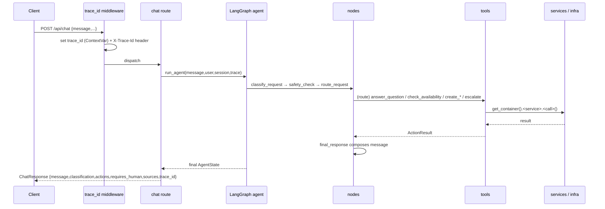

# Codebase Map — Doc Helper AI Agent

A complete, agent-oriented reference to **every part** of this project: the
directory tree, what each file does, the key symbols it exports, how a request
flows through the system, and where to change things. Read this first when you
need to understand or navigate the codebase.

> Keep this file in sync when you add/rename/remove modules or change public
> functions. It is the single source of truth for "where does X live?".

---

## 1. What this project is

A local-first, mock-mode-by-default AI agent backend (FastAPI + LangGraph) that
answers document questions (RAG) and handles clinic-style operations
(appointments, callbacks, complaints, human escalation). It is a **demo, not a
medical tool** and runs **fully offline without an API key**.

- Language/runtime: Python 3.12, packaged with `uv` (hatchling build).
- Entry point: `doc_helper_ai_agent.main:app` (package lives under `src/`).
- Deterministic mock mode is the default; OpenAI is only used when explicitly enabled.

---

## 2. Annotated directory tree

```
doc-helper-ai-agent/
├── pyproject.toml                 # deps, scripts, ruff & pytest config (pythonpath=src)
├── uv.lock                        # locked dependency versions
├── .env.example                   # all env vars (safe defaults, offline mock mode)
├── .gitignore                     # excludes .env, caches, .chroma, db files
├── README.md                      # portfolio README (features, setup, roadmap)
├── main.py                        # convenience launcher -> doc_helper_ai_agent.main:run
├── Dockerfile                     # multi-stage uv build, non-root runtime, healthcheck
├── .dockerignore                  # keeps build context lean (README.md kept for hatchling)
├── docker-compose.yml             # local orchestration (api service, healthcheck)
│
├── .github/                       # agent & maintainer customization (see .github/README.md)
│   ├── copilot-instructions.md    # always-on project guidelines
│   ├── CODEBASE_MAP.md            # THIS FILE — full codebase reference
│   ├── instructions/              # auto-attached rules (by applyTo glob or on-demand)
│   ├── prompts/                   # reusable /slash-command task templates
│   └── tools/                     # offline maintenance scripts (smoke_test.py, check.py)
│
├── data/
│   └── sample_docs/               # fake knowledge base indexed by RAG (no real data)
│       ├── clinic_faq.md          # hours, location, booking, emergencies FAQ
│       ├── pricing.md             # indicative prices, payment & insurance
│       ├── patient_policy.md      # cancellation, refunds, privacy, complaints
│       └── services.md            # services offered + specialist roster
│
├── src/
│   ├── main.py                    # back-compat shim -> doc_helper_ai_agent.main (app, run)
│   ├── agent.py                   # back-compat shim -> agent.graph (build_graph, run_agent)
│   ├── tools.py                   # back-compat shim -> tools.* modules
│   │
│   └── doc_helper_ai_agent/       # the actual package
│       ├── __init__.py            # __version__
│       ├── main.py                # FastAPI app factory, lifespan, trace_id middleware, run()
│       ├── dependencies.py        # Container (composition root) + get_container()/reset_container()
│       │
│       ├── api/
│       │   └── routes/
│       │       ├── health.py      # GET /health
│       │       ├── chat.py        # POST /api/chat  (main agent entry point)
│       │       └── documents.py   # GET /api/documents, POST /api/documents/search
│       │
│       ├── core/
│       │   ├── config.py          # Settings (pydantic-settings) + get_settings()
│       │   ├── logging.py         # trace_id-aware logging (get_logger, set/get_trace_id)
│       │   └── errors.py          # error types + register_exception_handlers()
│       │
│       ├── schemas/               # API request/response Pydantic models
│       │   ├── chat.py            # ChatRequest, ChatResponse
│       │   ├── documents.py       # DocumentInfo, Documents*/Search* models
│       │   └── tools.py           # ActionResult (uniform tool-result contract)
│       │
│       ├── domain/                # internal models & enums (no HTTP concerns)
│       │   ├── enums.py           # Classification, Route, Specialty, ToolStatus, TicketType
│       │   └── models.py          # Doctor, TimeSlot, SafetyAssessment, RetrievedChunk, RagResult
│       │
│       ├── services/              # business logic over infrastructure
│       │   ├── document_loader.py # load_documents() -> chunk markdown
│       │   ├── rag_service.py     # RagService (index + answer with citations)
│       │   ├── safety_service.py  # assess_message() -> SafetyAssessment
│       │   └── intake_service.py  # IntakeService (appointment/callback/complaint/escalation)
│       │
│       ├── agent/                 # LangGraph workflow
│       │   ├── state.py           # AgentState (TypedDict, actions has add reducer)
│       │   ├── prompts.py         # CLASSIFICATION_LABELS, CLASSIFIER_SYSTEM_PROMPT
│       │   ├── nodes.py           # the 8 node functions + classify/route helpers
│       │   └── graph.py           # build_graph(), get_agent(), run_agent()
│       │
│       ├── tools/                 # thin wrappers returning ActionResult
│       │   ├── appointment_tools.py  # infer_specialty/day, check_availability
│       │   ├── crm_tools.py          # create_appointment/callback/complaint
│       │   ├── knowledge_tools.py    # answer_question (RAG)
│       │   └── escalation_tools.py   # escalate_to_human
│       │
│       └── infrastructure/        # swappable adapters (mock external systems)
│           ├── mock_crm.py        # MockCRM (in-memory, generates APPT-/ESC-... IDs)
│           ├── mock_schedule.py   # MockSchedule (doctors + deterministic slots)
│           └── vector_store.py    # LocalVectorStore (keyword or optional embeddings)
│
└── tests/                         # pytest suite (offline, deterministic)
    ├── conftest.py                # autouse singleton reset + `client` fixture
    ├── test_health.py             # /health
    ├── test_chat_api.py           # /api/chat + /api/documents end-to-end
    ├── test_safety_service.py     # risk detection
    ├── test_intake_service.py     # CRM ID formats & increments
    ├── test_rag_service.py        # retrieval + citations
    └── test_agent_routing.py      # graph routing per intent
```

---

## 3. Layering & dependency direction

One-way only. **Never import "upward".**

```
api/routes  →  agent  →  tools  →  services  →  infrastructure
                                   ↘  domain / schemas / core (shared, no upward deps)
```

- `api` speaks HTTP and calls the agent (and, for documents, services via the container).
- `agent` nodes call `tools`.
- `tools` call `services`/infrastructure through the `Container`.
- `services` orchestrate `infrastructure`.
- `infrastructure` are leaf adapters (mock CRM/schedule/vector store).
- `domain`, `schemas`, and `core` are shared and depend on nothing app-specific.

The single wiring point is `dependencies.Container`.

---

## 4. Request lifecycle (POST /api/chat)



Graph shape (compiled once per process in `agent/graph.py`):

```
START → classify_request → safety_check → route_request ─┬─(escalate)──→ escalate_to_human ─────────┐
                                                         ├─(rag)───────→ answer_with_rag ───────────┤
                                                         ├─(appointment)→ check_availability →       │
                                                         │                 create_intake_or_callback ┤
                                                         └─(complaint)──→ create_intake_or_callback ─┤
                                                                                                     ↓
                                                                                             final_response → END
```

---

## 5. File-by-file reference

### Root & entry points

- **`main.py`** (root): convenience launcher; imports `run` from the package and calls it.
- **`src/doc_helper_ai_agent/main.py`**: the real app.
  - `create_app() -> FastAPI`: builds the app, configures logging, registers the
    `trace_id_middleware` (reads/creates `X-Trace-Id`, binds it via `set_trace_id`),
    registers exception handlers, includes routers.
  - `lifespan(app)`: on startup logs config and calls `get_container().rag.ensure_indexed()`.
  - `app`: module-level `FastAPI` instance (this is what uvicorn serves).
  - `run()`: console-script entry (`doc-helper-ai-agent`), starts uvicorn.
- **`src/main.py` / `src/agent.py` / `src/tools.py`**: backwards-compat shims that
  re-export from the package; safe to ignore for new work.

### `core/` — cross-cutting

- **`config.py`**
  - `Settings(BaseSettings)`: env-driven config (aliases like `APP_NAME`,
    `OPENAI_API_KEY`, `LLM_PROVIDER`, `ENABLE_MOCK_LLM`, `RAG_TOP_K`, paths).
  - Properties: `use_real_llm` (LLM gen/classify), `use_embeddings` (embedding RAG),
    `sample_docs_path`, `chroma_path`. `PROJECT_ROOT` is derived from this file's path.
  - `get_settings()`: `lru_cache`d singleton. Tests call `get_settings.cache_clear()`.
  - **Rule:** read config only through `get_settings()`, never `os.environ`.
- **`logging.py`**: `configure_logging(level)`, `get_logger(name)`,
  `set_trace_id/get_trace_id` (backed by a `ContextVar`), `_TraceIdFilter` injects
  `trace_id` into every record. Never log secrets.
- **`errors.py`**: `DocHelperError` (base) + `NotFoundError`, `ValidationError`,
  `AgentExecutionError`; `register_exception_handlers(app)` returns JSON
  `{error:{code,message,trace_id}}` and logs.

### `schemas/` — HTTP models (Pydantic v2)

- **`tools.py`**: `ActionResult{tool:str, status:ToolStatus, result:dict}` — the
  uniform, serialisable record every tool returns.
- **`chat.py`**: `ChatRequest{message,user_id,session_id}` (message min_length=1),
  `ChatResponse{message,classification,actions,requires_human,sources,trace_id}`.
- **`documents.py`**: `DocumentInfo`, `DocumentsResponse`, `DocumentSearchRequest`,
  `DocumentSearchResponse`.

### `domain/` — internal types

- **`enums.py`** (all `StrEnum`):
  - `Classification`: `appointment_request, pricing_question, document_question,
    emergency_or_pain, complaint, general_question, human_escalation`.
  - `Route`: `rag, appointment, complaint, escalate`.
  - `Specialty`: `general_dentistry, orthodontics, whitening, implants, emergency`.
  - `ToolStatus`: `success, error, skipped`.
  - `TicketType`: `appointment, callback, complaint, escalation`.
- **`models.py`**: `Doctor`, `TimeSlot`, `SafetyAssessment{triggered,categories,
  reason,recommended_action}`, `RetrievedChunk{id,text,source,score}`,
  `RagResult{answer,sources,chunks}`.

### `infrastructure/` — mock adapters (leaf, in-memory)

- **`mock_crm.py`**: `MockCRM` with `create_appointment_request`,
  `create_callback_request`, `create_complaint_ticket`,
  `create_human_escalation_ticket`, plus `get`/`all`. IDs like
  `APPT-2026-0001`, `CALLBACK-…`, `COMPLAINT-…`, `ESC-…` (thread-safe counters).
  Singletons: `get_crm()`, `reset_crm()`.
- **`mock_schedule.py`**: `MockSchedule.check_availability(specialty, preferred_day,
  limit)` → deterministic `TimeSlot`s from `_DOCTORS` + `_SLOT_TEMPLATE`.
  `list_doctors(specialty)`. Singletons: `get_schedule()`, `reset_schedule()`.
- **`vector_store.py`**: `LocalVectorStore.add(chunks)` / `.query(text, top_k)`.
  Default keyword scoring (`_tokenize`, overlap / √len, stopword-filtered);
  optional embedding path (`_embed` via OpenAI + `_cosine`) gated by
  `settings.use_embeddings`, with automatic fallback to keywords on failure.
  Singletons: `get_vector_store(settings)`, `reset_vector_store()`.

### `services/` — business logic

- **`document_loader.py`**: `load_documents(docs_dir)` reads `*.md`/`*.txt`,
  splits by heading (`_split_into_sections`) then size (`_chunk_section`,
  `_MAX_CHUNK_CHARS=900`), returns `[{"id","text","source"}]` (source = filename).
- **`rag_service.py`**: `RagService`
  - `ensure_indexed()` (thread-safe, once) loads + adds chunks to the store.
  - `answer(question, top_k)` → `RagResult`; mock mode composes from the top chunk
    (`_compose_mock_answer`), LLM mode synthesises grounded answer
    (`_synthesize_with_llm`, falls back to mock on error).
  - `document_summary()` → `[(source, chunk_count)]`.
  - Singletons: `get_rag_service(settings, store)`, `reset_rag_service()`.
- **`safety_service.py`**: `assess_message(message) -> SafetyAssessment`.
  Whole-word regex over `_RISK_KEYWORDS` categories: `severe_pain, bleeding,
  swelling, fever, trauma, diagnosis_request, medication_request, emergency`.
  On any match: `triggered=True` + a fixed `recommended_action` (no medical advice).
- **`intake_service.py`**: `IntakeService` wraps `MockCRM`:
  `create_appointment/create_callback/create_complaint/create_escalation`.
  Singletons: `get_intake_service(crm)`, `reset_intake_service()`.

### `agent/` — LangGraph workflow

- **`state.py`**: `AgentState(TypedDict, total=False)`. Inputs: `message, user_id,
  session_id, trace_id`. Derived: `classification, safety, requires_human, route,
  availability`. Outputs: `actions` (**`Annotated[list, operator.add]`** reducer),
  `sources`, `response_message`.
- **`prompts.py`**: `CLASSIFICATION_LABELS` (from the enum) and
  `CLASSIFIER_SYSTEM_PROMPT` (used only in optional LLM mode).
- **`nodes.py`** — the 8 nodes (each `AgentState -> partial AgentState`):
  - `classify_request`: `_classify` → keyword mode `_classify_keywords` (ordered:
    emergency → human → complaint → appointment → pricing → document → general),
    optional `_classify_llm` when `use_real_llm`.
  - `safety_check`: sets `safety` + `requires_human` from `assess_message`.
  - `route_request`: `_decide_route` → `Route`. Safety/emergency/human/low-confidence
    → `escalate`; pricing/document/general → `rag`; appointment → `appointment`;
    complaint → `complaint`.
  - `answer_with_rag`: calls `knowledge_tools.answer_question`; sets `sources`,
    `response_message`, appends action.
  - `check_availability`: calls `appointment_tools.check_availability`; stores
    `availability`.
  - `create_intake_or_callback`: complaint → `create_complaint_ticket` +
    `requires_human=True`; appointment → `create_appointment_request` if slots else
    `create_callback_request`.
  - `escalate_to_human`: `escalation_tools.escalate_to_human`, `requires_human=True`.
  - `final_response`: composes the user-facing `response_message` per route
    (`_compose_appointment_message`, `_find_ticket_id`).
- **`graph.py`**: `build_graph()` wires nodes/edges and the `_route_selector`
  conditional edge; `get_agent()` compiles once; `run_agent(message,user_id,
  session_id,trace_id)` builds the initial state (`actions=[]`, `sources=[]`) and
  invokes the graph, returning the final state dict.

### `tools/` — ActionResult wrappers

- **`appointment_tools.py`**: `infer_specialty(text)`, `infer_preferred_day(text)`,
  `check_availability(message)` → ActionResult with `{specialty, preferred_day,
  slot_count, slots}`.
- **`crm_tools.py`**: `create_appointment_request(user_id, availability, notes)`,
  `create_callback_request(...)`, `create_complaint_ticket(...)` → ActionResults
  carrying `ticket_id`/`status`.
- **`knowledge_tools.py`**: `answer_question(question, top_k)` → ActionResult with
  `{answer, sources, num_chunks}`.
- **`escalation_tools.py`**: `escalate_to_human(user_id, reason, categories,
  priority)` → ActionResult with escalation `ticket_id`.
- All tools obtain services via `get_container()` and return an `ActionResult`.

### `api/routes/`

- **`health.py`**: `GET /health` → `{status, service, version}`.
- **`chat.py`**: `POST /api/chat`; runs `run_agent`, maps the final state into
  `ChatResponse`, wraps failures in `AgentExecutionError`.
- **`documents.py`**: `GET /api/documents` (list indexed docs + chunk counts),
  `POST /api/documents/search` (direct RAG, bypassing the full agent).

### `dependencies.py`

- **`Container`**: holds `settings, crm, schedule, vector_store, rag, intake`
  (all shared singletons). `get_container()` / `reset_container()`.
- **Rule:** add new shared dependencies here, not as scattered globals.

### `tests/`

- **`conftest.py`**: autouse `reset_singletons` fixture (resets container + crm +
  schedule + vector_store + rag + intake before each test); `client` fixture
  returns a FastAPI `TestClient`.
- Test files map 1:1 to the requirements (health, chat API, safety, intake, RAG,
  routing). All pass offline with no API key.

### `data/sample_docs/`

Fake "BrightSmile Dental Clinic" content only. The loader chunks by `##` headings,
so keep one topic per section for good keyword retrieval. Never add real data/PII.

---

## 6. Cross-cutting concepts (must-know)

- **Mock mode is the default and must stay deterministic.** OpenAI is used only
  when `ENABLE_MOCK_LLM=false`, `LLM_PROVIDER=openai`, and `OPENAI_API_KEY` is set
  (`settings.use_real_llm` / `use_embeddings`). Every LLM/embedding call has a
  keyword/mock fallback inside `try/except`.
- **Singletons + reset.** Shared state lives behind `get_*()` singletons and the
  `Container`. Any new singleton needs a `reset_*()` and a call in `conftest.py`.
- **`trace_id`** is generated per request in middleware, flows through logs via a
  `ContextVar`, and is echoed in responses and the `X-Trace-Id` header.
- **`ActionResult`** is the audit trail. Nodes append `action.model_dump()` to the
  `actions` list (reducer = `operator.add`); the chat route re-validates them into
  `ActionResult` for the response.
- **Safety is non-negotiable.** No diagnosis/prescription/treatment advice; risk
  signals escalate with `requires_human=true`.

---

## 7. Change recipes — "where do I edit for…?"

| Goal | Edit |
| ---- | ---- |
| New API endpoint | add a router in `api/routes/`, include it in `main.create_app` |
| New agent tool | `tools/*.py` (return `ActionResult`) → call from a node → test |
| New intent label | `domain/enums.Classification` + `nodes._classify_keywords` + `nodes._decide_route` (+ prompt) |
| New route/branch | `domain/enums.Route` + `nodes._decide_route` + `graph.py` conditional edge |
| New knowledge doc | add `.md` under `data/sample_docs/`, verify via `/api/documents` |
| New risk term | `services/safety_service._RISK_KEYWORDS` + `tests/test_safety_service.py` |
| New CRM record type | `infrastructure/mock_crm` + `TicketType` + `intake_service` |
| New shared dependency | `dependencies.Container` (+ `reset_*` + conftest) |
| New config value | `core/config.Settings` + `.env.example` |

---

## 8. Gotchas

- Package lives under `src/`; `pyproject.toml` sets `pythonpath=["src"]` for pytest.
  Plain scripts must add `src/` to `sys.path` (see `.github/tools/smoke_test.py`).
- Keyword classification order matters — more urgent/specific checks come first.
- The compiled graph is a process singleton but holds no state; nodes fetch the
  container at call time, so per-test singleton resets still isolate state.
- `AgentState.actions` must be initialised to `[]` (the `add` reducer needs a list).
- `.env.example` is intentionally kept in git (`.gitignore` has `!.env.example`);
  real `.env` is ignored.
