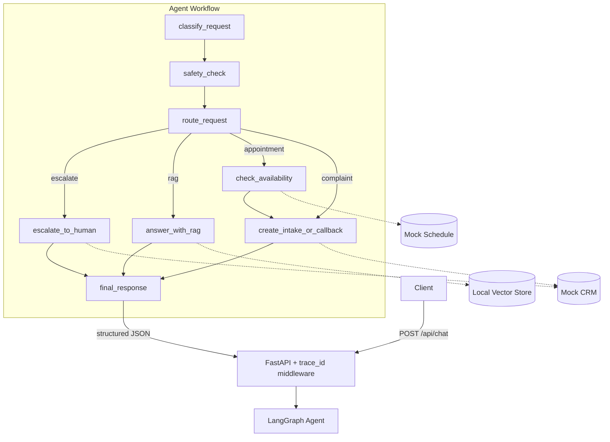

# Doc Helper AI Agent

A local-first, production-style **AI agent backend** for document Q&A and
clinic-style operations (appointments, callbacks, escalations). Inspired by a
dental clinic front-desk assistant, it demonstrates a clean, agentic workflow
built with **FastAPI** and **LangGraph** that runs **fully offline in
deterministic mock mode** — no API key required.

> ⚠️ **Disclaimer:** This is a **demo/portfolio project**. It is **not a medical
> tool** and must never be used for diagnosis, prescription, or treatment
> advice. It uses only **fake sample documents** and **no real patient data**.

---

## Why this project exists

Most "AI chatbot" demos are a single prompt to an LLM. Real assistants need
**structure**: intent classification, safety guardrails, tool use, retrieval
with citations, human-in-the-loop escalation, logging, and tests. This project
shows that architecture end-to-end in a way that is easy to run, easy to demo,
and easy to extend toward a real cloud deployment.

## Features

- 🧠 **Agentic workflow** with LangGraph (classify → safety → route → act → respond)
- 🗂️ **Intent classification** into 7 categories with deterministic keyword mode
  and optional LLM mode
- 📚 **Local RAG** over markdown docs with **source citations**
- 🛡️ **Safety service** that detects pain/bleeding/emergencies/diagnosis requests
  and **escalates to a human** instead of giving medical advice
- 🗓️ **Mock scheduling & CRM** producing realistic IDs (`APPT-2026-0001`, …)
- 🧾 **Structured JSON responses** with an auditable list of actions taken
- 🔎 **Per-request `trace_id`** propagated through logs and responses
- ✅ **Tests** that pass offline with no API key
- 🧱 **Clean architecture**: clear separation of API / agent / services /
  infrastructure

## Tech stack

| Concern            | Choice                                  |
| ------------------ | --------------------------------------- |
| Language           | Python 3.12                             |
| Web framework      | FastAPI + Uvicorn                       |
| Data validation    | Pydantic v2 / pydantic-settings         |
| Agent orchestration| LangGraph                               |
| LLM (optional)     | OpenAI SDK (mock mode by default)       |
| Vector store       | Local in-memory (Chroma-ready)          |
| Testing            | pytest + httpx                          |
| Linting            | ruff                                    |
| Packaging / env    | uv                                      |

## Architecture



### Layout

```
src/doc_helper_ai_agent/
  main.py            # FastAPI app + trace_id middleware + lifespan
  dependencies.py    # composition root (shared singletons)
  api/routes/        # health, chat, documents
  core/              # config, logging, errors
  schemas/           # request/response models
  domain/            # enums + internal models
  services/          # rag, document_loader, intake, safety
  agent/             # graph, nodes, state, prompts
  tools/             # appointment, crm, knowledge, escalation
  infrastructure/    # vector_store, mock_crm, mock_schedule
data/sample_docs/    # fake clinic docs used by RAG
tests/               # pytest suite (offline)
```

## Local setup

Prerequisites: Python 3.12 and [uv](https://docs.astral.sh/uv/).

```bash
uv sync
uv run uvicorn doc_helper_ai_agent.main:app --reload
```

The API is served at `http://localhost:8000` (interactive docs at `/docs`).

Copy the example environment file if you want to customise settings (optional —
the defaults run fully offline):

```bash
cp .env.example .env
```

## API examples

### Health

```bash
curl http://localhost:8000/health
```

```json
{ "status": "ok", "service": "doc-helper-ai-agent", "version": "0.1.0" }
```

### Chat — appointment request

```bash
curl -X POST http://localhost:8000/api/chat \
  -H "Content-Type: application/json" \
  -d '{
    "message": "I need to book an appointment for tooth whitening next Friday",
    "user_id": "demo-user",
    "session_id": "demo-session"
  }'
```

```json
{
  "message": "I found availability for whitening with Dr. Chloe Nguyen on Friday at 09:30. I've created appointment request APPT-2026-0001; our team will confirm the details with you.",
  "classification": "appointment_request",
  "actions": [
    { "tool": "check_availability", "status": "success", "result": {} },
    { "tool": "create_appointment_request", "status": "success", "result": {} }
  ],
  "requires_human": false,
  "sources": [],
  "trace_id": "…"
}
```

### Chat — emergency (escalates, never diagnoses)

```bash
curl -X POST http://localhost:8000/api/chat \
  -H "Content-Type: application/json" \
  -d '{ "message": "I have severe pain and my gum is bleeding" }'
```

`requires_human` will be `true` and an `escalate_to_human` action (`ESC-…`
ticket) is created.

### PowerShell (Windows)

```powershell
Invoke-RestMethod -Method Post -Uri http://localhost:8000/api/chat `
  -ContentType 'application/json' `
  -Body '{ "message": "What are your opening hours?", "user_id": "demo-user" }'
```

### Documents

```bash
curl http://localhost:8000/api/documents
curl -X POST http://localhost:8000/api/documents/search \
  -H "Content-Type: application/json" \
  -d '{ "query": "cancellation policy" }'
```

## Agent workflow

| Node                        | Responsibility                                            |
| --------------------------- | -------------------------------------------------------- |
| `classify_request`          | Assign one of 7 intent labels                            |
| `safety_check`              | Detect clinical risk / out-of-scope requests             |
| `route_request`             | Decide route: escalate / rag / appointment / complaint   |
| `answer_with_rag`           | Answer from the knowledge base with citations            |
| `check_availability`        | Look up slots in the mock schedule                       |
| `create_intake_or_callback` | Create appointment/callback/complaint records            |
| `escalate_to_human`         | Create a human-escalation ticket                         |
| `final_response`            | Compose the user-facing message                          |

**Routing rules**

- Emergency / pain / diagnosis-like messages → **safety → human escalation**
- Pricing / policy / service / general questions → **RAG**
- Appointment requests → **mock schedule + intake**
- Complaints → **complaint ticket + human follow-up**
- Unknown / low-confidence → **escalate**

**Classifications:** `appointment_request`, `pricing_question`,
`document_question`, `emergency_or_pain`, `complaint`, `general_question`,
`human_escalation`.

## Safety design

The agent is explicitly **not** a medical tool. The safety service flags
messages mentioning severe pain, bleeding, swelling, fever, trauma, diagnosis
requests, medication/prescription questions, or emergencies. For any such
message the agent:

1. **Avoids diagnosis or treatment advice.**
2. **Recommends contacting a professional / clinic** (and emergency services if
   life-threatening).
3. **Creates a callback / escalation** and sets `requires_human = true`.

## Mock mode vs. real LLM

By default (`ENABLE_MOCK_LLM=true`, no `OPENAI_API_KEY`) everything is
deterministic and offline: keyword classification and keyword RAG retrieval. Set
`ENABLE_MOCK_LLM=false`, `LLM_PROVIDER=openai`, and provide `OPENAI_API_KEY` to
enable LLM classification, embedding-based retrieval, and LLM answer synthesis.

## Developer experience

```bash
uv sync                                                   # install deps
uv run uvicorn doc_helper_ai_agent.main:app --reload      # run the API
uv run pytest                                             # run tests (offline)
uv run ruff check .                                       # lint
```

## Roadmap

- [ ] **Frontend** (chat UI)
- [ ] **AWS** deployment: Lambda + API Gateway, S3 for documents
- [ ] **Real vector DB** (Chroma persistence / managed vector store)
- [ ] **Auth** (API keys / OAuth) and rate limiting
- [ ] **Observability** (OpenTelemetry traces, metrics, dashboards)
- [ ] **CI/CD** (lint + test + deploy pipeline)

## Disclaimer

This is a demonstration project for portfolio purposes. It does **not** provide
medical advice, diagnosis, or treatment, uses only **fake** sample documents,
and stores **no real patient data**.
